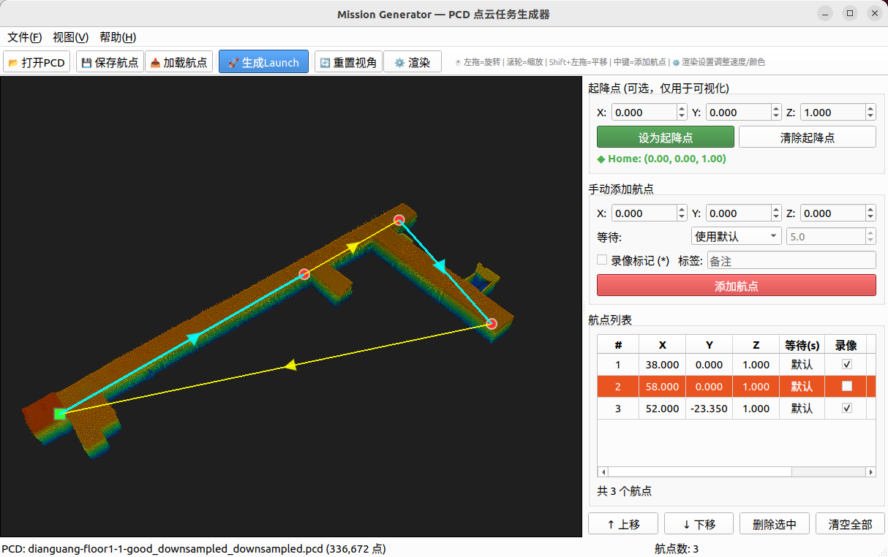

# Mission Generator — PCD 点云可视化与 ROS 任务点生成器

一款跨平台的桌面工具，用于在 3D 点云地图上选取任务航点，并生成与 `mission_manger.cpp` 兼容的 ROS1 launch 文件。


---

## 功能

- **3D 点云可视化** — 加载 PCD 文件（支持 ASCII / Binary / Compressed 格式），按高度着色渲染
- **航点选取** — 鼠标点击点云选点 + 手动输入坐标，两种方式添加任务航点
- **航点属性配置** — 每个航点可设置：自定义等待时间、永久等待、录像标记 `*`、备注标签
- **起降点可视化** — 可选的 Home 位置，3D 视图中展示完整飞行路径连线
- **Launch 文件生成** — 一键生成与 `mission_manger.cpp` 完全兼容的 ROS1 XML launch 文件
- **航点集管理** — 支持将航点保存为 JSON 文件，方便复用

## 截图



## 安装

### 方式一：可执行文件（推荐，无需 Python）

从 [Releases](../../releases) 下载对应平台的打包文件，直接运行即可。

| 平台 | 下载文件 | 使用方式 |
|------|---------|---------|
| **Linux** | `MissionGenerator` | `chmod +x MissionGenerator && ./MissionGenerator` |
| | `install.sh` | 一键安装到 `~/.local/bin` + 桌面图标集成 |
| **Windows** | `MissionGenerator.exe` | 双击运行（已嵌入图标） |
| **macOS** | `MissionGenerator.app` | 双击运行 |

> 📖 **详细安装步骤见 [USER_GUIDE.md](USER_GUIDE.md) 第 2 章。**

**系统要求**：仅需 OpenGL 2.1+ 显卡驱动（所有现代系统均自带）。无需安装 Python 或任何依赖。

### 方式二：从源码运行

```bash
# 1. 克隆仓库
git clone <repo-url> && cd mission_generator

# 2. 安装依赖（仅 numpy, PySide6, vispy）
pip install -r requirements.txt

# 3. 启动
python main.py
```

**依赖清单**：`PySide6>=6.5`, `numpy>=1.24`, `vispy>=0.14`, `python-lzf`（可选，用于 compressed PCD）

### 自行打包

```bash
pip install pyinstaller
python build.py         # 打包
python build.py --clean # 清理构建文件
```

> `.gitignore` 已配置，`dist/`、`build/`、`*.spec` 等构建产物不会被提交到 Git。

## 使用教程

> 📖 **详细操作手册请参阅 [USER_GUIDE.md](USER_GUIDE.md)**，包含手把手级别的操作指南、快捷键速查和故障排除。

### 1. 打开点云

点击 **📂 打开PCD** 或 `Ctrl+O`，选择 `.pcd` 文件。

### 2. 选取航点

**方式 A — 鼠标点选（推荐）**：在 3D 视图中**中键点击**点云上的任意位置：

1. 黄色菱形 (◇) 预览标记立即出现在拾取位置
2. 弹出**悬浮**航点对话框（不遮挡 3D 视图，仍可旋转/缩放确认位置）
3. 微调坐标时预览标记实时跟随移动
4. 确认 → 正式航点，取消 → 移除预览

**左键点击**则自动填入右侧面板的坐标输入区。

**方式 B — 手动输入**：在右侧面板直接输入 X/Y/Z 坐标，设置等待时间和录像标记，点击 **添加航点**。

### 3. （可选）设置起降点

在"起降点"区域输入坐标或从点云拾取，点击 **设为起降点**。起降点以绿色方块显示在 3D 视图中，并绘制 Home → WP1 → WP2 → ... → Home 的飞行路径连线。

> **注意**：起降点仅用于可视化，不会写入 launch 文件的 waypoints 参数。

### 4. 编辑航点

- **双击**表格单元格可直接编辑坐标、等待时间、标签
- **右键**表格可删除、上移、下移航点
- **Ctrl+S** 保存航点集为 JSON 文件，**Ctrl+L** 加载已保存的航点集

### 5. 渲染设置

点击 **⚙️ 渲染** 调整：点大小、透明度、颜色模式、航点大小、航线颜色/宽度、平移速度（1~100×）。

### 6. 生成 Launch

点击 **🚀 生成Launch** 或 `Ctrl+G`：

1. 在"ROS 参数"标签页配置话题名称、阈值参数等
2. 在"航点预览"标签页确认数据
3. 选择输出路径，点击 **生成 Launch 文件**

## 航点格式说明

生成的 launch 文件中航点格式为：

```
[[x, y, z]* , [x, y, z, wait_time], ...]
```

| 语法 | 含义 |
|---|---|
| `[x, y, z]` | 基础航点，使用全局默认等待时间 |
| `[x, y, z]*` | 带录像标记的航点 |
| `[x, y, z, 5.0]` | 自定义等待 5.0 秒 |
| `[x, y, z, 0]` | 永久等待（∞），悬停直到外部控制 |

## 生成的 Launch 文件

```xml
<launch>
    <arg name="odom_topic" default="/localization"/>
    <arg name="pose_topic" default="/mavros/local_position/pose"/>
    <arg name="goal_topic" default="/goal_pose"/>
    <arg name="distance_threshold" default="0.5"/>
    <arg name="wait_time" default="5.0"/>
    <arg name="start_delay" default="3.0"/>
    <arg name="topic_timeout" default="2.0"/>
    <arg name="mission_cycle" default="true"/>
    <arg name="waypoints" default="[[35.0, 0.0, 0.6]*]"/>

    <node pkg="uav_px4_ctrl" type="mission_manger"
          name="mission_manger" output="screen">
        <param name="odom_topic" value="$(arg odom_topic)"/>
        <!-- ... -->
    </node>
</launch>
```

## 常见问题

**Q: 打包后的程序多大？**
A: 约 100-130 MB（PyInstaller onefile）。

**Q: 目标机器需要装什么？**
A: 什么都不需要。打包后的可执行文件自带 Python 运行时和所有依赖。

**Q: 支持哪些 PCD 格式？**
A: ASCII、Binary、Binary Compressed（需 `python-lzf`）。

**Q: 生成的 launch 文件在哪用？**
A: 直接在 ROS1 环境中 `roslaunch`，配合 `uav_px4_ctrl` 包的 `mission_manger` 节点使用。

## License

MIT
